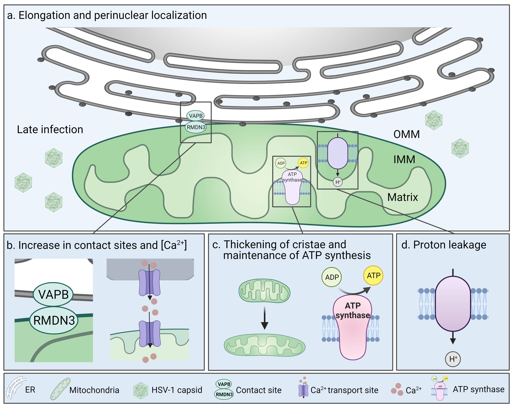

> [!IMPORTANT]
> Please cite the paper if you use the data or the code!

**Fig 7. Mitochondrial structure and function are altered in response to progression of herpesvirus infection.**

**(a)** Progression of HSV-1 infection from 4 to 8–12 hpi triggers mitochondrial elongation and repositioning to the perinuclear region. **(b)** The number of the ER-mitochondria membrane contact sites tethered by VAPB and RMDN3 is increased at late infection and mitochondrial Ca2+ content is elevated. **(c)** The progression of infection leads to the thickening of mitochondrial cristae and recovery of ATP production to the level of noninfected cells. **(d)** At the same time, the infection stimulates proton leakage across the mitochondrial inner membrane. VAPB, vesicle-associated membrane protein B; RMDN3, regulator of microtubule dynamics 3; OMM, outer mitochondrial membrane; IMM, inner mitochondrial membrane.

Made with BioRender

https://doi.org/10.1371/journal.ppat.1011829.g007
